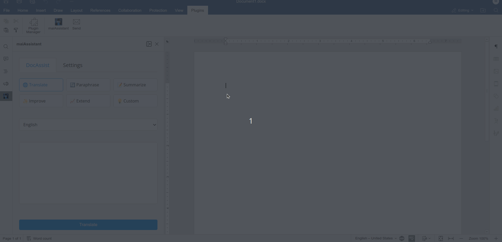
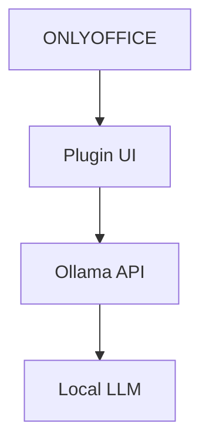

# maiAssistant - AI Assistant for ONLYOFFICE



Translate, paraphrase, and enhance text directly in ONLYOFFICE using local AI powered by Ollama.

## Key Features

✅ **Local AI Processing** - All processing happens on your machine  
✅ **Multi-functionality** - Translate, paraphrase, summarize, and more  
✅ **Privacy Focused** - No data leaves your computer  
✅ **Model Flexibility** - Works with various Ollama models  
✅ **Multi-language Support** - 10+ languages available  

## 🚀 Installation Guide

### Prerequisites
1. Install [Ollama](https://ollama.ai/)
2. Pull a language model:
```bash
ollama pull llama3.1  # Recommended base model
ollama pull mistral # Alternative model
```

### Installation Options
| Method | Command | Description |
|--------|---------|-------------|
| User Install | `./install.sh --user` | Installs for current user only |
| System Install | `sudo ./install.sh --system` | System-wide installation |

## 🛠️ Usage Guide

### Basic Translation
1. Select text in your document
2. Open Plugins tab → DocAssist
3. Choose target language
4. Click "Translate"

### UI Customization
- Translation area height: 190px (default)
- Expanded view height: 260px

### Advanced Features
- **Translate**: Translate selected text
- **Paraphrase**: Rewrite selected text
- **Summarize**: Create concise summary
- **Improve**: Enhance writing quality
- **Extend**: Elaborate on the text

## ⚙️ Configuration

Access settings via the Settings tab to:
- Change Ollama API URL
- Select different AI models
- Adjust generation temperature

## 🧑‍💻 For Developers

### Recommended Models
| Model | Best For | Size |
|-------|----------|------|
| llama3.1 | General purpose | 7B |
| mistral | Multilingual | 7B |
| codellama | Technical text | 7B |

### Architecture


## ❓ Troubleshooting

### Common Issues
1. **Ollama not running**  
   ```bash
   ollama serve  # Start the Ollama service
   ```

2. **Model not loaded**  
   ```bash
   ollama pull llama3.1  # Download the model
   ```

3. **Connection refused**  
   Verify Ollama is running on `http://localhost:11434`

## 📜 License

Apache 2.0 - See [LICENSE](LICENSE) for details.

## 🔗 Resources
- [OnlyOffice Plugin Docs](https://api.onlyoffice.com/docs/plugin-and-macros/get-started/overview/)
- [Ollama Documentation](https://github.com/ollama/ollama)
